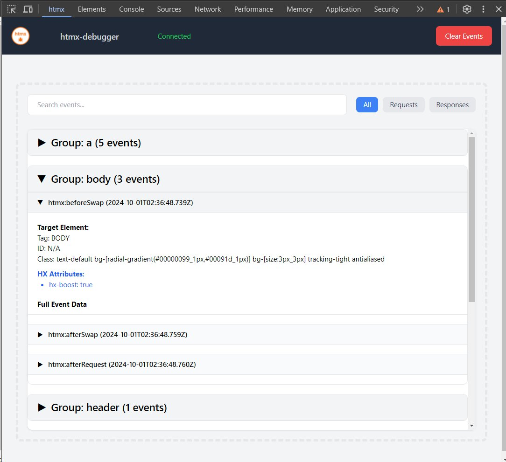

# htmx-debugger v1.0.0 - 2024-09-30

## Overview

htmx-debugger is a powerful Chrome extension designed to help developers debug and analyze htmx applications. It provides a comprehensive and user-friendly interface for viewing htmx events, requests, and responses in real-time. This tool is essential for understanding and troubleshooting htmx-powered web applications, making the development process smoother and more efficient.

## Features

-   Real-time capture and display of htmx events
-   Intelligent grouping of related events for easier analysis
-   Powerful search functionality to filter events
-   One-click clear button to reset the debugger view
-   Flexible event filtering (All, Request, Response)
-   Collapsible event details for a cleaner interface
-   Detailed timing information for request-response cycles
-   Live connection status indicator
-   Automatic periodic connection checks for improved stability
-   Robust error handling and reporting

## Future

-   Export functionality to save captured events as a JSON file
-   Import capability to load and analyze events from a JSON file

## Installation

### Chrome Web Store (Recommended)

1. Visit the [htmx-debugger page](https://chrome.google.com/webstore/detail/htmx-debugger/[extension-id]) on the Chrome Web Store.
2. Click the "Add to Chrome" button.
3. Confirm the installation when prompted.

### Manual Installation (For developers)

1. Clone this repository or download the source code.
2. Open Google Chrome and navigate to `chrome://extensions/`.
3. Enable "Developer mode" by toggling the switch in the top right corner.
4. Click on "Load unpacked" and select the directory containing the extension files.
5. The htmx-debugger extension should now appear in your list of installed extensions.

## Usage

### Opening the Debugger

1. Navigate to a webpage that uses htmx.
2. Open Chrome DevTools (Right-click > Inspect or press F12).
3. Look for the "htmx" tab in the DevTools panel. If you don't see it, click on the ">>" icon to find it in the list of additional tools.

### Debugging htmx Events

The debugger automatically captures htmx events as they occur on the page. Each event is displayed with the following information:

-   Event type
-   Timestamp
-   Target element details
-   Event-specific details
-   XHR information (for relevant events)

### Using the Debugger Features

1. **Connection Status**: Check the connection status indicator in the panel header to ensure the debugger is properly connected.
2. **Search**: Use the search bar at the top to filter events based on their content.
3. **Clear**: Click the "Clear" button to reset the debugger and remove all captured events.
4. **Event Filtering**: Use the filter buttons to show all events, only requests, or only responses.
5. **Expand/Collapse**: Click on an event header to expand or collapse its details.
6. **Timing Information**: For grouped events, the total duration is displayed at the bottom of the group.

## Troubleshooting

-   If you don't see any events in the debugger, ensure that the webpage you're debugging is actually using htmx.
-   If the htmx tab doesn't appear in DevTools, try reloading the page or reopening DevTools.
-   Check the browser console for any error messages related to the extension.
-   If the connection status shows "Disconnected", try reloading the page.
-   If problems persist, try disabling and re-enabling the extension, reloading the webpage, or restarting Chrome.

## Development

### Key File Structure

-   `background.js`: Background script for message handling and service worker setup
-   `content.js`: Content script for capturing htmx events and communication with background script
-   `devtools.html`: DevTools panel HTML
-   `devtools.js`: DevTools panel functionality
-   `manifest.json`: Extension configuration, permission or configuration changes
-   `panel.html`: Panel HTML for displaying captured events and debugger controls
-   `panel.js`: Panel functionality for handling event display and debugger features

There are many other build/development-related files in addtion to those listed above. If you're contributing or modifying for your own purposes you should recgonize these.

## Privacy Policy

htmx-debugger is committed to protecting user privacy and does not collect or use any personal user data. The extension operates solely within the context of the user's browser to provide debugging functionality for htmx applications.

### Permissions and Their Justifications

1. **activeTab**: This permission is required to access the current tab's content and inject the necessary scripts for debugging htmx events. It allows the extension to interact with the webpage being debugged without requiring broader permissions.

2. **alarms**: The alarms permission is used to schedule periodic connection checks, ensuring the debugger maintains a stable connection to the webpage. This improves the reliability of the debugging process.

3. **host permission**: Host permissions are necessary to allow the extension to function on any webpage that uses htmx. This broad access is required because htmx can be used on any website, and the debugger needs to be able to capture events regardless of the domain.

4. **remote code**: The extension does not execute any remote code. All functionality is contained within the extension package.

5. **scripting**: Scripting permissions are essential for the core functionality of the debugger. They allow the extension to inject the necessary scripts to capture and analyze htmx events on the webpage.

6. **storage**: The storage permission is used to save user preferences and debugging session data locally. This ensures that the user's debugging environment persists between browser sessions and allows for future features like saving and loading debug logs.

### Single Purpose Description

The single purpose of htmx-debugger is to provide a comprehensive debugging tool for web developers working with htmx-powered applications. It captures, displays, and analyzes htmx events in real-time, offering insights into the behavior and performance of htmx interactions within web pages.

### Data Usage Compliance

htmx-debugger complies with the Chrome Web Store Developer Program Policies regarding data usage. The extension:

-   Does not collect any personal user data
-   Does not transmit any captured debugging information outside of the user's browser
-   Only processes information necessary for its core debugging functionality
-   Stores data locally and solely for the purpose of improving the user's debugging experience

By using htmx-debugger, users can be assured that their privacy is respected and that the extension operates within the bounds of its stated purpose as a development tool for htmx applications.

## Version History

-   v1.0.0 (2024-09-30): Initial release
    -   core features implemented
    -   Chrome Web Store release

For a detailed changelog, please check the repository's commit log.

## License

This project is licensed under the MIT License. See the [LICENSE](LICENSE) file for details.

## Contact

For any questions, support, or feedback, please contact the author through standard channels.

## Repository

The source code for this project is available on GitHub:

https://github.com/NomadicDaddy/htmx-debugger

For bug reports or feature requests, please use the [issue tracker](https://github.com/NomadicDaddy/htmx-debugger/issues).
